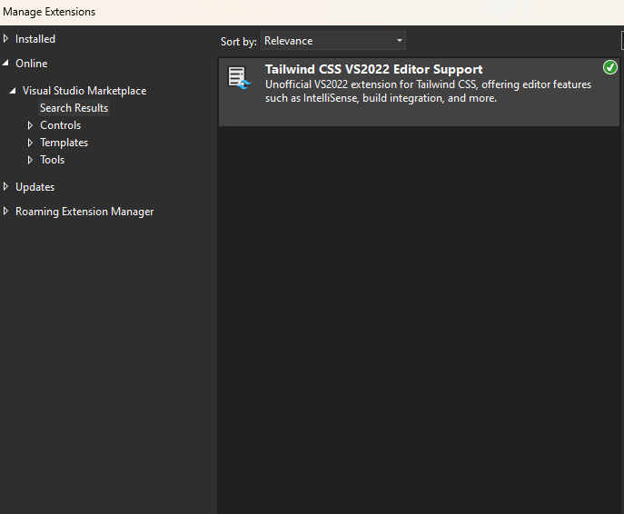
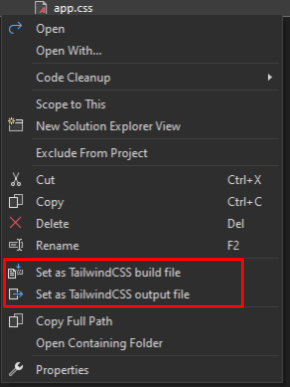
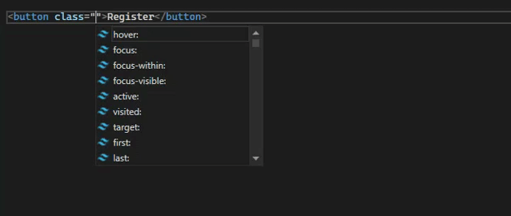

# Getting Started

## Installation

1. Download from the [Visual Studio Marketplace](https://marketplace.visualstudio.com/items?itemName=TheronWang.TailwindCSSIntellisense) or directly from the IDE.

- If you are downloading from the IDE, open Extensions > Manage Extensions and search up 'Tailwind'.

**IMPORTANT**: This extension uses `npm` for building and setting up, so follow the [official npm documentation](https://docs.npmjs.com/downloading-and-installing-node-js-and-npm) guide.

## Opening a New Project

2. Once you have created a project, right click on the project node and click 'Set up TailwindCSS':

This will import the Tailwind CSS node modules and configure your `tailwind.config.js`.

3. To configure Tailwind CSS, follow the [official documentation](https://tailwindcss.com/docs/installation) (specifically steps 2, 3, and 5).

- Make sure you include `@tailwind base; @tailwind components; @tailwind utilities;` in your css file or your file will not build.
- Also, make sure your `tailwind.config.js` has a valid `content` value, such as `["./**/*.{html,cshtml,razor,js}"]`.

4. Before you are ready to build, set your input CSS file. Your output file will automatically be generated, but if you want to specify a certain file, you can right click and click 'Set as TailwindCSS output file'.

5. Type in any HTML or CSS files, including `.html`, `.css`, `.cshtml`, `.razor` among other files, and IntelliSense will show up.

6. To build your file, either manually start the build process under Build > Start TailwindCSS build process.

If, at any point, you wish to change the extension's behavior, you can update extension settings in Tools > Options > TailwindCSS IntelliSense.