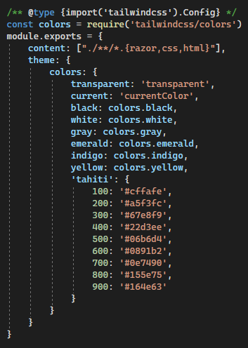
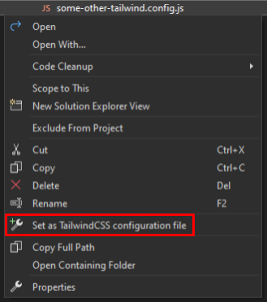

# VS2022 Editor Support for Tailwind CSS

Editor features such as IntelliSense, build integration, among others for TailwindCSS to enhance the development experience in Visual Studio 2022.

Download from the [Visual Studio Marketplace](link).

## Disclaimer

This is NOT an official Tailwind CSS extension and is NOT affiliated with Tailwind Labs Inc. 

## Prerequisites

This extension uses npm for multiple features, so you should have npm installed to avoid errors.

To check if you have npm installed, run `npm -v` in the terminal.

If you do not have npm installed, follow [this tutorial](https://docs.npmjs.com/downloading-and-installing-node-js-and-npm) from the official npm docs.

## Usage

### IntelliSense

Tailwind CSS classes show up in the IntelliSense completion menus in Razor, HTML, and CSS files:

Customization support for `theme.colors`, `theme.screens`, and `theme.spacing` as well as their `theme.extension` counterparts:

Other attributes, such as `borderRadius` and `fontFamily`, are not yet supported.

### Build Integration

In a project, simply run the project to build Tailwind CSS or access it via the Build menu:

Or in an open folder, go directly to the Build menu to start the build process:

After the process has started, the process will continue to build and output data to the Build window pane:

### NPM Shortcuts

When getting started in a new project, you can import the necessary modules by right-clicking on the project node:

### Customizability

#### Build

If you want to explicitly state the configuration file, you can right click any Javascript file as follows:

Likewise, for the build file and the output file, you can also explicitly state what CSS files you want:

There is a respective removal option for each action, which can be accessed by clicking on the same file in the solution explorer to reset it back to default.

#### Extension Options

By going into Tools > Options > TailwindCSS Intellisense, you can alter the global behavior for the extension:

From here, you can choose to do the following:

* Disable/enable automatic Tailwind module updates
* Alter the default build output file name
* Disable/enable extension features globally
* Change the order in which completions are appended

## Troubleshooting

### Build

If you notice that your build file is not being updated, check the Build output window to see if you have any syntax errors:

<small>
*Build output modified for brevity*
</small>

### Extension

If something doesn't work as expected or you see an exception message, you can check the detailed log in the Extensions output window.

Please report any errors that you encounter!

## Limitations

As of right now, Visual Studio does not provide an API to override error tagging, so you will see the CSS directives (`@apply`, `@tailwind`, etc.) marked as errors.

## Bugs / Suggestions

If you run into any issues or come up with any ideas while using this extension, please create  an issue!
